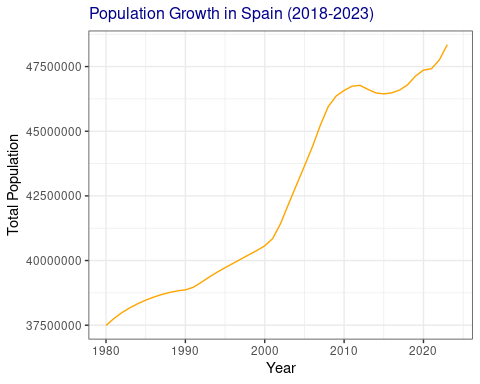
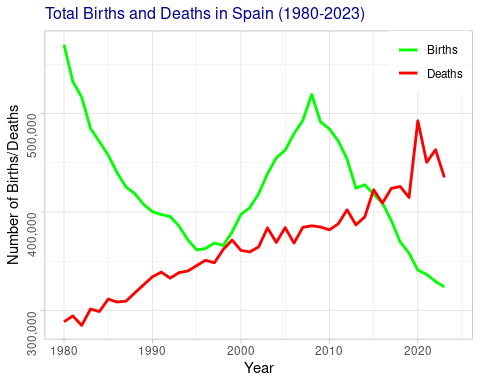

# 📊 Economic Data 2024 - Mini Project 1

---

## 🚀 Project Overview

This project analyzes Spain’s **population growth and demographic trends** from 1980 to 2024 using World Bank data from the *World Development Indicators (WDI)*.  
Key indicators include:

- Total Population  
- Crude Birth Rate  
- Crude Death Rate  

We explore population changes, births, and deaths to understand demographic shifts and challenges like aging population and migration impacts.

---

## 1️⃣ Population Growth Analysis

Spain's population has steadily increased from about **37.5 million** in 1980 to approximately **48.5 million** by 2024.  
A notable surge between **2002 and 2008** was influenced by a temporary rise in birth rates and migration inflows of over 5 million migrants (Worlddata.info).

Later years saw slowed growth due to **declining birth rates** and **rising death rates**, challenging demographic stability.  

### Population Growth Trend

*Figure 1: Population Growth in Spain (1980-2023)*

---

## 2️⃣ Births and Deaths Dynamics

To analyze births and deaths, we calculated their absolute numbers using:

\[
\text{Births} = \text{Crude Birth Rate} \times \frac{\text{Total Population}}{1000}
\]

\[
\text{Deaths} = \text{Crude Death Rate} \times \frac{\text{Total Population}}{1000}
\]

**Key Observations:**  
- Birth rates have dropped since the 1980s with some cyclic trends.  
- Death rates have steadily increased.  
- From 2016 onwards, birth rates are below replacement levels, increasing Spain’s dependency on migration.

### Total Births and Deaths Over Time

*Figure 2: Total Births and Deaths in Spain (1980-2023)*

---

## 📂 Project Structure

- `ESP_Population.csv` — Cleaned demographic dataset  
- R scripts for data download, cleaning, and visualization  
- Plots stored as `.png` files for embedding in reports  

---

## 🛠️ Tools & Libraries Used

- R packages: `WDI`, `dplyr`, `ggplot2`, `tidyr`  
- Data from World Bank’s WDI API  
- Visualization with `ggplot2`  

---

## 👨🏽‍💻 Author

Paul Muriithi – passionate about data analysis, demography, and creating insightful reports.

---

## 🔗 Links

- [World Bank World Development Indicators](https://databank.worldbank.org/source/world-development-indicators)  
- [Project Data CSV](./ESP_Population.csv)  

---

## 💡 Next Steps & Insights

- Explore migration data alongside birth/death rates for deeper insights.  
- Project future population trends using demographic modeling.  
- Assess economic impacts of aging populations on Spain’s workforce.  

---

Thanks for checking out this mini project! Feel free to ⭐ the repo or reach out for collaboration.  
---

